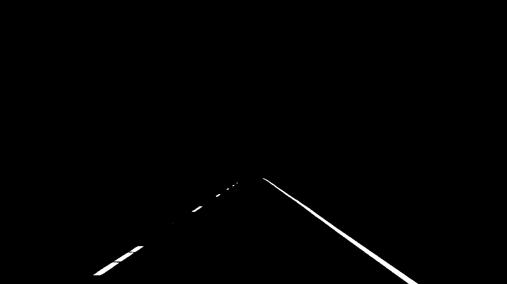

TLDR;
To detect lane lines color, shape, position and orientation of vehicle in the image are important.

Imp colors to remember:
[255, 255, 255] - white
[0, 0, 0] - black

A pure computer vision way is to

Technique 1:
1. Determine what colors your lane lines are 2. Figure out what part of the image your interested in (Your Region of Interest).

Technique 2: Canny Edge Detection

Converts to grayscale. Calculate gradient (where brightness of pixel determines strength of gradient). Find edges by tracing out the pixels that have strongest gradients.

# Technique 1: (Color Selection)
```import matplotlib.pyplot as plt
import matplotlib.image as mpimg
import numpy as np


image = mpimp.imread('file.png')
print("image dimensions", image.shape)

xsize, ysize = image.shape()

# Note: always make a copy rather than simply using "="
color_select = np.copy(image)

#Color selection criteria
# Makes sure that everything apart from white shows on screen
red_threshold = 200
green_threshold = 200
blue_threshold = 200
rgb_threshold = [red_threshold, green_threshold, blue_threshold]

# Identify pixels below the threshold
thresholds = (image[:,:,0] < rgb_threshold[0]) \
            | (image[:,:,1] < rgb_threshold[1]) \
            | (image[:,:,2] < rgb_threshold[2])
color_select[thresholds] = [0,0,0]

color_select[thresholds] = [0,0,0]

# Display the image                 
plt.imshow(color_select)
plt.show()
```





##Technique 2: (Region Masking)

```# Define a triangle region of interest
# Keep in mind the origin (x=0, y=0) is in the upper left in image processing
# Note: if you run this code, you'll find these are not sensible values!!
# But you'll get a chance to play with them soon in a quiz
left_bottom = [0, 539]
right_bottom = [900, 300]
apex = [400, 0]

# Fit lines (y=Ax+B) to identify the  3 sided region of interest
# np.polyfit() returns the coefficients [A, B] of the fit
fit_left = np.polyfit((left_bottom[0], apex[0]), (left_bottom[1], apex[1]), 1)
fit_right = np.polyfit((right_bottom[0], apex[0]), (right_bottom[1], apex[1]), 1)
fit_bottom = np.polyfit((left_bottom[0], right_bottom[0]), (left_bottom[1], right_bottom[1]), 1)

# Find the region inside the lines
XX, YY = np.meshgrid(np.arange(0, xsize), np.arange(0, ysize))
region_thresholds = (YY > (XX*fit_left[0] + fit_left[1])) & \
                    (YY > (XX*fit_right[0] + fit_right[1])) & \
                    (YY < (XX*fit_bottom[0] + fit_bottom[1]))

# Color pixels red which are inside the region of interest
region_select[region_thresholds] = [255, 0, 0]

# Display the image
plt.imshow(region_select)
```

#Technique 3: Canny Edge Detection
Step 1: Grayscale conversion
Step 2: Calculate gradient (where brightness of pixel determines strength of gradient)
Step 3: Find edges by tracing out the pixels that have strongest gradients.

edges = cv2.Canny(gray, low_threshold, high_threshold)
